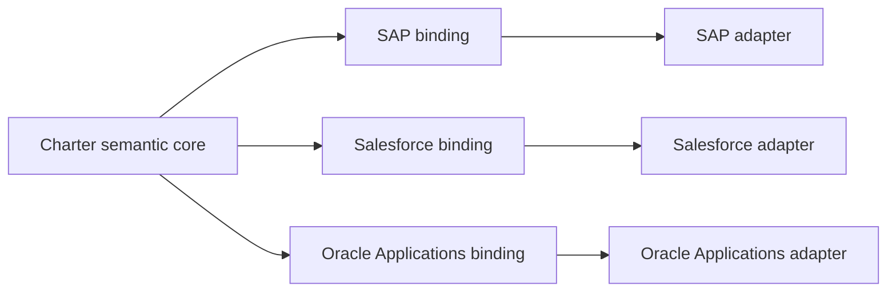

# Nauticana Charter

**An open specification for designing, governing, and operating the agentic enterprise, aligned with TOGAF and the SAP Enterprise Architecture Framework.**

Nauticana Charter (Charter) is an independently developed, open-source specification and operating model for organizing humans, AI agents, and enterprise systems around shared business processes.

Its purpose is not to replace an enterprise's human organization. It creates an aligned agent organization that supports employees, automates repetitive work, and preserves human accountability at decision and approval points.

It extends an existing enterprise architecture with an agentic operating model. It does not replace TOGAF, the SAP Enterprise Architecture Framework, an ERP or CRM platform, or the enterprise's established architecture practice.

This repository holds the normative model, schemas, and conformance corpus together with the Go reference SDK (`sdk/`) and the `charter` validation CLI (`cmd/charter`), which validate the Harbor example and the conformance fixtures on every change.

## Specification status and repository map

The specification is an unreleased draft. Start with the [specification index](spec/README.md).

- `spec/` contains normative semantics and behavioral requirements.
- `schema/` contains normative language-independent schemas.
- `conformance/` defines profiles, traceability, rules, and fixtures.
- `examples/` contains non-normative scenarios. Core example objects remain vendor-independent, while examples may name external products to illustrate bindings.
- `sdk/` and `cmd/` contain the Go reference SDK and the `charter` validation CLI.
- `doc/` contains non-normative strategy and architecture decisions.

See [CONTRIBUTING.md](CONTRIBUTING.md) for change requirements and [GOVERNANCE.md](GOVERNANCE.md) for specification authority and release policy.

## The problem

An enterprise already has:

- An organization tree
- Positions with assigned responsibilities
- Humans assigned to those positions
- Business processes spanning multiple positions and departments
- ERP, CRM, and other systems with role-specific permissions, screens, reports, and APIs

Adding independent AI agents does not by itself create a coherent operating model. The enterprise must know which work each agent supports, which human remains accountable, what the agent is authorized to do, and whether any responsibility has been left uncovered.

## The idea

Charter defines an agent organization alongside the human organization. Agents do not need to mirror positions one-to-one: one agent may support several positions, and several specialized agents may collaborate in support of one position.

The alignment is based on business responsibilities rather than organization-chart similarity. For every enterprise task, Charter should make it possible to identify:

- The business process, task, and expected outcome
- The accountable human position
- The human or agent performing the work
- The enterprise system and capability being used

This creates a responsibility and capability map across the enterprise. Its goal is to ensure that every relevant task has an accountable owner and suitable support. Authority, human decision points, and exception handling are governed separately for each assignment.

## What is a Charter agent?

A **Charter agent is an identifiable and governed digital actor that pursues assigned business outcomes on behalf of the enterprise**. It observes business context, determines appropriate next actions within policy, uses authorized capabilities, collaborates with humans or other agents, and produces auditable results.

A Charter agent is a logical enterprise-architecture entity, not a prescribed model or programming technology. It may use an LLM for interpretation, reasoning, or communication, but it may also combine rules, workflow, optimization, conventional software, or human input.

[Scout](https://github.com/nauticana/scout), the open-source agent studio and MCP service platform, is the initial reference platform for hosting Charter agents.

An agent's identity, responsibility, authority, and behavioral contract define it as a Charter agent—not its model, programming language, or deployment location.

Every Charter agent has:

- A stable identity and lifecycle
- A declared business purpose and one or more assigned responsibilities
- Defined triggers, inputs, business context, and expected outcomes
- Explicit roles, permissions, data access, and transaction limits
- A set of enterprise capabilities and tools it may use
- Policies governing how it selects, proposes, approves, or executes actions
- Human decision points and escalation conditions
- Observable state and an auditable record of actions and results
- An accountable organizational context, even when it supports several positions

An agent has bounded agency: it can select among permitted actions in response to context, but it cannot expand its own authority or redefine its responsibilities. When the required action falls outside its authority, policy, confidence, or capability, it must stop, request approval, delegate, or escalate.

The following concepts are related but distinct:

- A **business process** defines the flow of work and desired business outcome; an agent participates in or coordinates parts of that process.
- A **role** groups responsibilities and authority; an agent may be assigned roles but is not itself a role.
- A **capability or tool** performs a callable operation; an agent chooses and uses capabilities within its authority.
- An **LLM** may provide reasoning or language capabilities; an LLM alone has no enterprise identity, responsibility, or authority and is therefore not a Charter agent.
- A **workflow** follows an explicitly modeled sequence; an agent may invoke, supervise, or participate in workflows while adapting its actions to context.
- An **MCP server or enterprise API** exposes capabilities and information; it is part of the agent's operating environment, not the agent itself.
- **Scout** provides the initial reference runtime for Charter agents and their MCP interactions.

A conventional service that merely executes a fixed operation when called is not, by itself, a Charter agent. It becomes part of an agentic system when a governed agent uses it to pursue an assigned business outcome.

## Enterprise architecture alignment

Charter is designed as an agentic extension to a customer's existing enterprise architecture. It uses the architecture to understand the enterprise before proposing agents or automation. This keeps agent initiatives connected to business strategy, capabilities, processes, organization, information, applications, technology, and governance.

Within the TOGAF architecture domains, Charter contributes the following views:

- **Business architecture:** Business capabilities, value streams, processes, organization units, positions, responsibilities, decisions, and human-agent work allocation
- **Data architecture:** Business information used or produced by agents, its ownership, sensitivity, quality, lineage, retention, and permitted use
- **Application architecture:** ERP, CRM, SRM, and other application capabilities; agent capabilities; interactions; integrations; and responsibility boundaries
- **Technology architecture:** Agent runtimes, models, protocols, infrastructure, identity, observability, and security services

Security, RBAC, accountability, auditability, and human oversight apply across all four domains.

Charter fits into an iterative architecture-development lifecycle:

1. Describe the baseline architecture, including current responsibilities, processes, systems, interfaces, controls, and manual work.
2. Define the target agentic architecture, including desired agent capabilities, human-agent collaboration, delegation, and automation levels.
3. Perform a gap analysis to find uncovered responsibilities, repetitive work, missing system capabilities, control weaknesses, and integration needs.
4. Identify architecture building blocks and candidate solutions without assuming that every gap requires an AI agent.
5. Create a governed transformation roadmap based on business value, risk, dependencies, and organizational readiness.
6. Measure outcomes and evolve the architecture as processes, systems, policies, and agent capabilities change.

This makes Charter useful both as a design model and as a structured advisory method. Architecture gaps can lead to implementation, integration, process-improvement, training, governance, or managed-service opportunities. Those opportunities must remain traceable to documented enterprise needs rather than being driven by a predetermined product choice.

## Vendor-neutral core, SAP-first validation

The normative Charter core is vendor-neutral. Its concepts, schemas, capability contracts, authority model, and conformance rules must not depend on SAP, Salesforce, Oracle Applications, or another external platform.

SAP is Charter's primary validation platform and first commercial binding target because of the breadth and maturity of its business-process coverage, enterprise architecture content, authorization model, and integration capabilities. SAP is used to test whether Charter's neutral abstractions can represent a sophisticated enterprise landscape without introducing SAP-specific fields into the core model.

SAP has three roles in Charter:

- **Primary validation platform:** SAP processes, organization structures, authorization concepts, and system interactions test the completeness of the Charter model.
- **First-class binding:** SAP receives the deepest initial profile, mapping, adapter, and accelerator coverage.
- **Non-normative reference:** SAP examples may explain design decisions, but SAP terminology and implementation choices are not required by the Charter specification.

For an SAP-centered enterprise, a downstream SAP binding should relate Charter concepts to SAP business capabilities, value streams, processes, organizational responsibilities, authorization concepts, applications, integrations, and appropriately licensed reference architecture content. Equivalent bindings may support Salesforce, Oracle Applications, specialist applications, custom systems, and other ERP, CRM, or SRM platforms.

## External-system binding model

Charter defines stable enterprise semantics independently of the products that implement them. External systems participate through standardized profiles and bindings, while executable adapters remain downstream implementations.

The integration concepts are distinct:

- A **profile** describes a vendor product, version, available capabilities, and supported contract features.
- A **binding** declaratively maps Charter capabilities, data, authority, events, and errors to vendor concepts.
- An **adapter** is executable software that authenticates with and communicates with the vendor system.
- An **accelerator pack** is a maintained collection of profiles, bindings, process mappings, controls, examples, and implementation guidance for a vendor or industry.

The Charter core should define neutral objects such as `EnterpriseSystem`, `SystemProfile`, `CapabilityContract`, `CapabilityBinding`, `DataBinding`, `AuthorityBinding`, `EventBinding`, and `BindingConformance`. It must not add core fields for vendor transactions, objects, authorization mechanisms, or product APIs.

When a vendor requires concepts that have no neutral equivalent, its binding may carry namespaced extensions that the Charter core treats as opaque. Vendor-specific profiles, mappings, adapters, and accelerators should live in separate downstream packages or repositories.

An agent is authorized against a stable Charter capability. A binding translates that capability and authority into the target system's operation and permission model. Changing an API, integration protocol, or adapter must not silently change the enterprise meaning or authority of the capability.

## Human-agent collaboration

Agents should first take on work that is repetitive, time-consuming, or dependent on gathering information from several systems. They may monitor, prepare, reconcile, recommend, coordinate, or execute according to the authority granted to them.

Humans retain accountability and remain involved wherever judgment, approval, material risk, or organizational policy requires it. Automation is therefore not all-or-nothing: a task can move through levels such as observation, recommendation, preparation, approval-gated execution, and bounded autonomous execution.

Examples include:

- Investigating sales-order exceptions and preparing corrective actions
- Matching purchase orders, receipts, and invoices, then escalating discrepancies
- Monitoring production or material-planning exceptions
- Preparing procurement requests and routing them for approval
- Following up on receivables and proposing collection actions
- Reconciling transactions and surfacing unexplained differences

## Authority, control, and accountability

Nauticana's open-source Keel and Scout repositories provide the initial reference implementation of RBAC for humans and agents. Charter defines the vendor-neutral requirements needed to align system permissions with organizational responsibility and process context; compatible implementations may satisfy those requirements through other platforms.

An agent that supports multiple positions does not automatically receive the combined authority of those positions. Its access remains explicit, scoped, and auditable. The model must preserve separation of duties, approval limits, delegated authority, and the distinction between proposing an action and executing it.

Every action must be evaluated against the agent's assigned authority in its current organizational and process context. The resulting evidence must record the inputs, action, applicable authority, human decisions, outcome, and any escalation. This provides the operational proof that the responsibility map and RBAC policy were followed without restating that map for every action.

## Enterprise process coverage

Charter is intended to support a configurable hierarchy of end-to-end processes. The catalog is not closed: terminology and process boundaries vary by framework, platform, industry, and enterprise.

The primary SAP-aligned end-to-end process families are:

- Lead to cash
- Source to pay
- Design to operate
- Recruit to retire
- Record to report

Within those broad families, or alongside them where an enterprise models them independently, Charter may cover processes such as:

- Market to lead
- Opportunity to order
- Order to cash
- Invoice to cash
- Customer request to resolution
- Contract to renewal
- Source to contract
- Procure to pay
- Invoice to pay
- Demand to supply
- Plan to fulfill
- Plan to produce
- Forecast to replenish
- Idea to market
- Concept to product
- Quality event to resolution
- Acquire to commission
- Operate to maintain
- Acquire to decommission
- Hire to retire
- Travel to reimburse
- Plan to optimize financials
- Close to disclose
- Treasury to liquidity
- Project to profit
- Strategy to execution
- Data to insight

These names are reference classifications, not a universal taxonomy. Charter should preserve each customer's established process architecture, support aliases and parent-child relationships, and map it to SAP reference content or another vendor profile where useful. It should not force a customer to rename a process merely to make it agent-ready.

The long-term scope may therefore include receiving orders, material planning, production, purchasing, sales, service, workforce management, asset management, projects, payments, reporting, and treasury. Adoption should begin with bounded workflows where responsibility is clear and the benefit can be measured, particularly exception-heavy work that currently requires repeated investigation and coordination.

Useful measures include cycle time, manual touches per case, exception backlog, correction rate, approval latency, and unauthorized or policy-violating actions.

## Agent-ready enterprise systems

Charter defines how ERP, CRM, SRM, and related systems expose business capabilities to authorized agents without making a particular vendor protocol part of the core model. Existing platforms may offer extensive APIs, while newer platforms may use smaller and more focused services. Charter provides a consistent capability contract across both approaches without attempting to erase their different business semantics.

The contract should describe more than API shape. It should express:

- The business capability and operation
- Required roles and permissions
- Inputs, outputs, and process state
- Validation and policy constraints
- Approval and separation-of-duties requirements
- Idempotency, audit, and error behavior
- Whether an operation reads, proposes, approves, or executes
- Requirements that every vendor binding and adapter must preserve

The capability contract is stable across bindings. One implementation may expose it through MCP, another through REST, an event interface, a vendor API, or an in-process Go provider. MCP and other protocols are bindings of Charter capabilities, not the foundation of their business meaning.

This capability model can become the basis for an agent-ready enterprise-application standard over time. It begins as a practical integration contract, validated initially against SAP's mature business capabilities and interfaces, and evolves only where common cross-platform semantics are proven.

## Scope of this repository

This repository defines the vendor-neutral specification and interfaces that express the Charter operating model. The initial reference implementation is expected to integrate with:

- [keel](https://github.com/nauticana/keel) for Go backend foundations and RBAC
- [scout](https://github.com/nauticana/scout) for the agent studio, agent authorization, and MCP services
- [sail](https://github.com/nauticana/sail) for the Angular user interface

The repository should contain normative documentation, language-independent schemas, neutral binding contracts, conformance rules and fixtures, examples, and a Go reference SDK. Vendor-specific profiles, bindings, adapters, proprietary reference content, and commercial accelerator packs remain downstream.

The interfaces should describe enterprise-architecture relationships, organizational responsibility, agent capability, controlled delegation, process participation, enterprise-system operations, approvals, escalation, and auditability. They should support both baseline and target architectures so that gaps and transformation opportunities can be identified explicitly.

The central objective is a governed enterprise in which humans and agents work as one aligned organization without leaving tasks unowned or authority ambiguous.

For guidance on building and commercializing independent downstream implementations, see the [downstream product strategy](doc/downstream_strategy.md).

## License

Nauticana Charter is licensed under the [Apache License 2.0](LICENSE).

## Reference frameworks

- [The TOGAF Standard](https://publications.opengroup.org/standards/togaf)
- [SAP Enterprise Architecture Framework](https://help.sap.com/docs/SAP_ENTERPRISE_ARCHITECTURE_FRAMEWORK)
- [SAP EA Methodology: Using Industry Standards](https://help.sap.com/docs/SAP_ENTERPRISE_ARCHITECTURE_FRAMEWORK/60bc20e6e0a24426a817705bcb415220/4e7ea6772c9f4ef69ff2e94b3aa09ac3.html)
