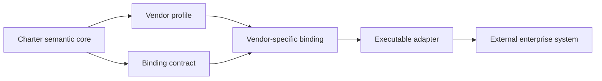
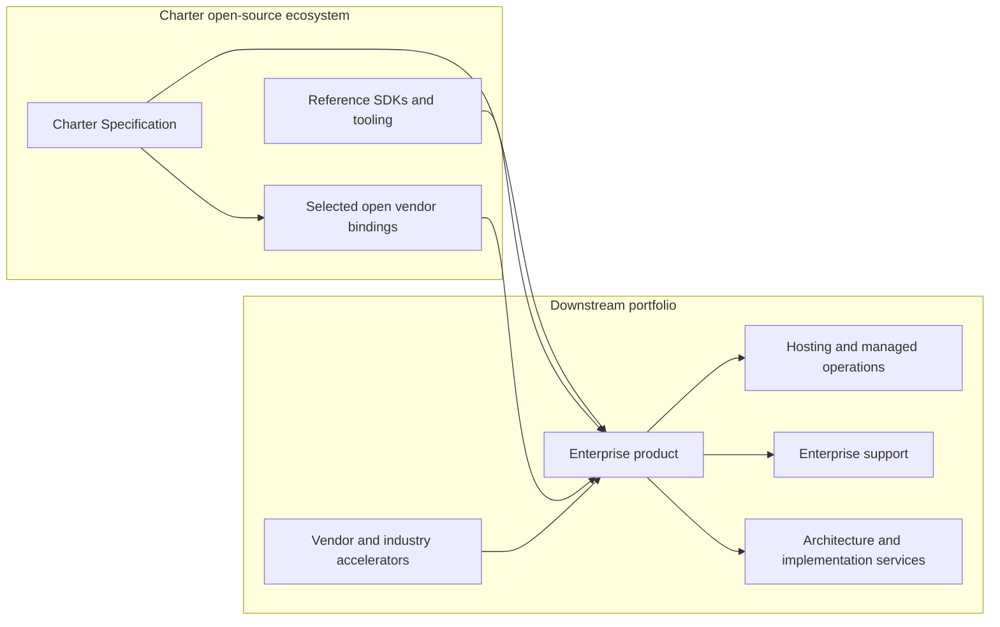

# Charter Downstream Product Strategy Guide

This document provides guidance for organizations that implement, extend, support, or commercialize products based on Charter. It describes a recommended separation between the open project and downstream offerings. It is not legal advice.

## Recommended model

Downstream implementers should use an **open-specification, differentiated-product** model:

- **Charter** is the open, vendor-neutral architecture and interoperability contract.
- **Downstream products** implement or extend that specification with operational capabilities, maintained content, integrations, and services.
- **Downstream organizations** own and operate their respective products, commercial content, services, and brands.
- Related open-source foundations remain independently reusable and do not require adoption of any particular downstream product.

The specification should be useful without a downstream product, and each downstream product should provide substantially more operational value than the specification alone.

## Open-source and commercial boundaries

| Asset | Recommended steward | Proposed model |
|---|---|---|
| Charter specification | Charter project | Apache License 2.0 |
| Charter interfaces and schemas | Charter project | Apache License 2.0 |
| Neutral binding model, conformance tests, examples, and adapter SDK | Charter project | Apache License 2.0 |
| Independently maintained reusable foundations | Their respective open-source projects | Their respective open-source licenses |
| Minimal vendor bindings or adapters | Charter project or a downstream implementer | Open or commercial, decided independently |
| Downstream enterprise application | Downstream implementer | Open or commercial license |
| Deep vendor mappings and industry accelerator content | Downstream implementer | Open, commercial, or separately licensed as appropriate |
| Hosting, support, consulting, and managed services | Downstream provider | Commercial services |

Apache License 2.0 permits broad reuse, including commercial reuse, while not granting rights to the licensor's product names or trademarks. This supports open interoperability while allowing the licensor and downstream implementers to protect their respective brands. See the [Apache License 2.0](https://www.apache.org/licenses/LICENSE-2.0.html) and [Apache licensing guidance](https://www.apache.org/legal/apply-license).

## Open Charter specification

The open specification should define the common enterprise language and behavioral contracts required for compatible implementations, including:

- Enterprises, organization units, positions, roles, and responsibilities
- Human and agent identities
- Charter agent definition and lifecycle
- Business capabilities, value streams, processes, and tasks
- Delegated authority, approval boundaries, and separation of duties
- Human-agent alignment and accountability
- Capabilities, tools, interfaces, and behavioral contracts
- Vendor-neutral system profiles and binding contracts
- Baseline, target, gap, and roadmap architecture concepts
- Audit, evidence, exception, and escalation semantics
- Conformance requirements and versioning rules

The open artifacts should include enough interfaces, schemas, examples, and validation tooling for another organization to build a compatible agent, enterprise-system adapter, or architecture tool.

## Vendor integration strategy

Charter should not avoid SAP or other enterprise platforms, but its normative core must isolate itself from their product-specific concepts. The core defines stable enterprise semantics and a standard binding model. Vendor-specific mappings and executable integrations remain downstream.



The layers have separate responsibilities:

- A **profile** identifies a vendor product, version, capabilities, and supported Charter contract features.
- A **binding** declaratively maps Charter capabilities, data, authority, events, and errors to vendor concepts.
- An **adapter** implements authentication, communication, retries, transaction behavior, monitoring, and other runtime concerns.
- An **accelerator pack** combines maintained profiles, bindings, process mappings, controls, examples, and implementation guidance for a vendor or industry.

The open Charter specification should define neutral objects such as `EnterpriseSystem`, `SystemProfile`, `CapabilityContract`, `CapabilityBinding`, `DataBinding`, `AuthorityBinding`, `EventBinding`, and `BindingConformance`. It should define how namespaced vendor extensions work but should treat their contents as opaque.

Core Charter objects must not contain fields tied to SAP transactions, Salesforce objects, Oracle responsibilities, or another vendor's authorization and API model. An agent is authorized against a stable Charter capability; a binding translates that capability into the external system's operations and permissions without changing its enterprise meaning.

Vendor deliverables should remain independently licensable:

| Deliverable | Recommended location | Typical model |
|---|---|---|
| Binding schema and conformance requirements | Charter repository | Apache License 2.0 |
| Fictional vendor-neutral examples | Charter repository | Apache License 2.0 |
| Minimal vendor profile or adapter | Charter or a separate downstream repository | Open when ecosystem adoption is valuable |
| Deep product/version mappings | Separate downstream repository or content service | Open or commercial |
| Vendor and industry accelerator packs | Separate downstream repository or content service | Open or commercial |
| Customer-specific landscape mappings | Customer environment or controlled project repository | Customer-confidential |

Potential downstream repositories include:

| Repository | Responsibility |
|---|---|
| Charter core repository | Normative specification, neutral schemas, binding contracts, and conformance |
| Optional Charter SDK repository | Reference SDK when it needs an independent release lifecycle |
| Open downstream binding repositories | Vendor profiles or adapter components selected for ecosystem adoption |
| Private downstream repositories | Enterprise products, proprietary mappings, accelerator packs, and customer delivery assets |

An SDK may initially remain in the core repository and move to a dedicated repository only when its release cadence or dependency management justifies separation.

## Downstream enterprise products

A downstream enterprise product can turn the open model into an operational product. Potential differentiated capabilities include:

- Enterprise architecture repository and visual modeling
- Organization, responsibility, and capability mapping
- Agent organization design and portfolio management
- Baseline-to-target gap analysis
- Human-agent work allocation and automation-level design
- Agent lifecycle, delegation, and approval management
- Governance and separation-of-duties analysis
- Runtime monitoring, evidence, and audit
- Integrated application-framework and agent-runtime experience
- SAP landscape discovery and architecture mappings
- SAP authorization and control analysis
- SAP, industry, and process accelerator packs
- Transformation roadmaps, value cases, and executive reporting
- Hosted, private-cloud, and on-premises deployment
- Enterprise support, upgrades, and managed operations

The downstream product's advantage should come from the integrated experience, curated content, operational tooling, vendor expertise, ongoing maintenance, support, and customer outcomes—not from making the basic interoperability contract secret.

## Ecosystem structure



This separation allows related foundations to remain reusable across unrelated projects. Charter and downstream products can use those foundations without changing their independent purpose or requiring their users to adopt Charter.

## Ownership and stewardship

Each downstream implementer should clearly document the ownership or authorized stewardship of:

- Its downstream product names and trademarks
- Its downstream product copyrights
- Vendor and industry content it creates
- Domains, package names, repositories, release accounts, and product identities
- Customer agreements, subscriptions, consulting deliverables, and support obligations

An implementer's ownership chain should be documented explicitly. Personally created assets, particularly assets created before the implementing organization existed or outside an employment relationship, should be assigned or licensed in writing as appropriate. An attorney should confirm the correct arrangement.

Copyright and attribution notices should consistently identify the actual copyright owner. For a downstream-owned repository, a suitable notice would be:

```text
Copyright © <downstream copyright owner>
SPDX-License-Identifier: Apache-2.0
```

A downstream open-source project should also establish a documented contribution policy. A Developer Certificate of Origin may be sufficient for ordinary Apache-licensed contributions; a contributor agreement may be appropriate if the implementer later needs broader relicensing or contribution terms. Legal counsel should review that choice before accepting substantial outside contributions. Contributions to Charter itself follow the Charter project's own documented contribution policy.

## Brand structure

Downstream implementers should maintain a clear brand hierarchy:

- **Charter:** Open project, architecture, and interoperability contract
- **Downstream product brand:** The implementer's product or distribution
- **Implementing organization:** Vendor, contracting party, and service provider

Each implementer should perform formal trademark, domain, company-name, and software-package clearance before launch. Open-source licensing and trademark ownership remain separate: the Apache License permits implementation of the specification but does not grant rights to the Charter name or imply that a downstream implementation is an official Charter project offering. Downstream naming and marketing must not suggest endorsement by the Charter project unless that has been explicitly agreed.

## TOGAF commercial use

The Open Group states that commercial use of the TOGAF Standard—including developing products, software, tools, consultancy, and training for other organizations—requires a current commercial license. Before an implementer offers a Charter-based product, methodology, or consulting service as TOGAF-aligned, it should obtain appropriate advice and licensing from The Open Group.

- [TOGAF Standard commercial licensing](https://www.opengroup.org/togaf-standard-10th-edition-commercial-license)
- [TOGAF Standard downloads and licensing](https://www.opengroup.org/togaf-standard-10th-edition-downloads)

Charter should reference and align with TOGAF concepts without copying or redistributing protected TOGAF materials beyond the rights granted by the applicable license.

## SAP content and branding

SAP can serve as a primary validation platform and an initial downstream binding target, but implementers should maintain clear boundaries among the vendor-neutral Charter specification, their own intellectual property, and SAP-owned material.

SAP should have three deliberate roles:

- **Primary validation platform:** Its breadth tests whether Charter's neutral semantics are sufficient for complex enterprise landscapes.
- **First-class binding:** It receives the deepest initial mapping, adapter, conformance, and accelerator coverage.
- **Non-normative reference:** It may inform examples and design decisions without making SAP terminology mandatory in Charter core.

Downstream SAP bindings may define original mappings, interfaces, adapters, metadata, and architecture relationships involving SAP products. The open Charter core should contain only the neutral binding mechanism and, where useful and legally appropriate, non-normative examples. Neither an open nor commercial distribution should redistribute proprietary SAP reference content, documentation, diagrams, or licensed customer material unless its distributor has explicit rights to do so.

Marketing language should use formulations such as:

- Compatible with SAP products
- Integrates with SAP systems
- Aligned with the SAP Enterprise Architecture Framework
- Designed for SAP-centered and heterogeneous landscapes

It should not imply SAP certification, endorsement, partnership, joint development, or a joint offering unless that status has been formally obtained. SAP product names and trademarks should follow SAP's current third-party usage requirements. See the [SAP Partner Communication Guidelines](https://assets.dm.ux.sap.com/sa_te_materials/sap_partner_communication_guidelines.pdf).

## Suggested downstream adoption path

A practical sequence is:

1. Establish the implementer's ownership, contribution policy, and downstream trademark strategy.
2. Select and document the supported Charter specification and conformance versions.
3. Implement the vendor-neutral binding model and validate it with a bounded SAP binding.
4. Use the specification in architecture assessments and selected SAP-centered engagements.
5. Build a differentiated downstream product around the highest-value recurring assessment, governance, and operating workflows.
6. Package reusable SAP, process, and industry mappings as maintained commercial accelerators.
7. Add Salesforce, Oracle Applications, and other bindings according to customer demand.
8. Offer enterprise deployment, support, managed operations, and advisory services.
9. Grow a compatible ecosystem without implying that downstream products are official Charter project offerings.

This model makes the specification an adoption channel and allows downstream implementations, content, operations, and services to sustain their own business models.
