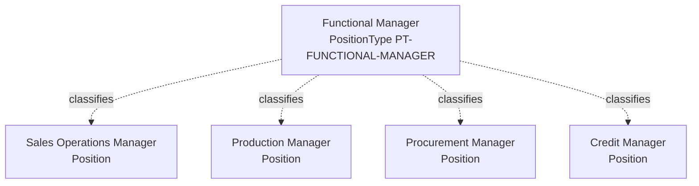
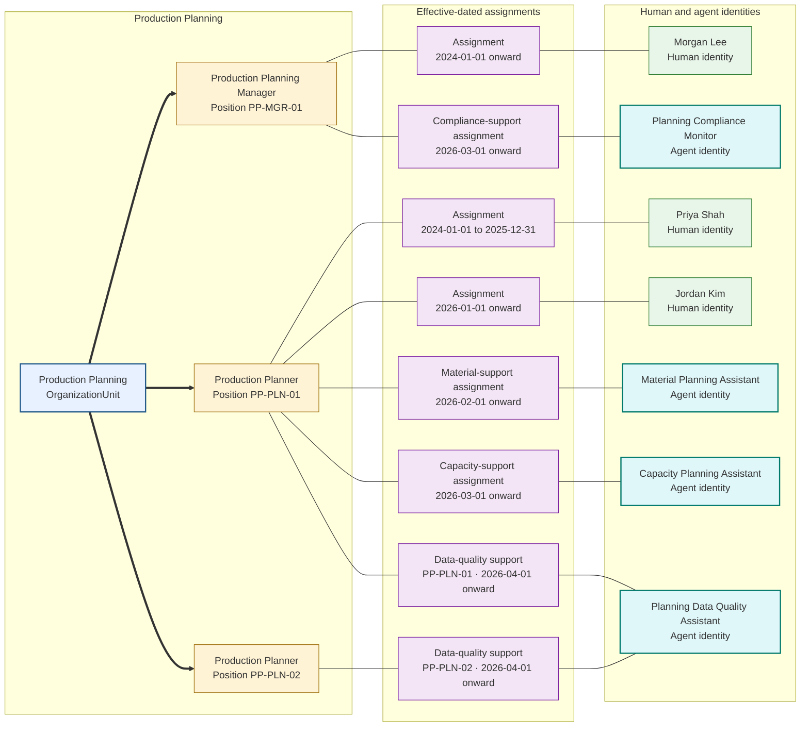

# Harbor Manufacturing Enterprise

Harbor Manufacturing contains four primary functional organization units beneath its root organization unit:

- Sales Operations owns customer-order intake and exception coordination.
- Production owns planning, assembly, quality, and fulfillment readiness.
- Procurement owns supplier sourcing and component purchasing.
- Finance owns credit policy, invoicing, receivables, and financial control.

```mermaid
flowchart TB
    Enterprise["Harbor Manufacturing<br/>Enterprise"]

    subgraph HarborGroup["Harbor Manufacturing Organization"]
        direction LR
        Harbor["Harbor Manufacturing Organization<br/>OrganizationUnit"]
        GeneralManager["General Manager<br/>Position"]
        Harbor --> GeneralManager
    end

    subgraph SalesGroup["Sales Operations"]
        direction LR
        Sales["Sales Operations<br/>OrganizationUnit"]
        SalesManager["Sales Operations Manager<br/>Position"]
        SalesCoordinator["Sales Coordinator<br/>Position"]
        Sales --> SalesManager
        Sales --> SalesCoordinator
    end

    subgraph OrderManagementGroup["Order Management"]
        direction LR
        OrderManagement["Order Management<br/>OrganizationUnit"]
        OrderManager["Order Management Manager<br/>Position"]
        OrderSpecialist["Order Specialist<br/>Position"]
        PricingSpecialist["Pricing Specialist<br/>Position"]
        OrderManagement --> OrderManager
        OrderManagement --> OrderSpecialist
        OrderManagement --> PricingSpecialist
    end

    subgraph SalesSupportGroup["Sales Support"]
        SalesSupport["Sales Support<br/>OrganizationUnit"]
    end

    subgraph ProductionGroup["Production"]
        direction LR
        Production["Production<br/>OrganizationUnit"]
        ProductionManager["Production Manager<br/>Position"]
        Production --> ProductionManager
    end

    subgraph ProductionPlanningGroup["Production Planning"]
        direction LR
        ProductionPlanning["Production Planning<br/>OrganizationUnit"]
        PlanningManager["Production Planning Manager<br/>Position"]
        ProductionPlanner["Production Planner<br/>Position"]
        ProductionPlanning --> PlanningManager
        ProductionPlanning --> ProductionPlanner
    end

    subgraph AssemblyGroup["Assembly"]
        direction LR
        Assembly["Assembly<br/>OrganizationUnit"]
        AssemblySupervisor["Assembly Supervisor<br/>Position"]
        Assembly --> AssemblySupervisor
    end

    subgraph QualityGroup["Quality"]
        direction LR
        Quality["Quality<br/>OrganizationUnit"]
        QualityManager["Quality Manager<br/>Position"]
        Quality --> QualityManager
    end

    subgraph ProcurementGroup["Procurement"]
        direction LR
        Procurement["Procurement<br/>OrganizationUnit"]
        ProcurementManager["Procurement Manager<br/>Position"]
        Procurement --> ProcurementManager
    end

    subgraph SupplierManagementGroup["Supplier Management"]
        SupplierManagement["Supplier Management<br/>OrganizationUnit"]
    end

    subgraph PurchasingGroup["Purchasing"]
        direction LR
        Purchasing["Purchasing<br/>OrganizationUnit"]
        Buyer["Buyer<br/>Position"]
        Purchasing --> Buyer
    end

    subgraph FinanceGroup["Finance"]
        direction LR
        Finance["Finance<br/>OrganizationUnit"]
        FinanceDirector["Finance Director<br/>Position"]
        Finance --> FinanceDirector
    end

    subgraph CreditControlGroup["Credit Control"]
        direction LR
        CreditControl["Credit Control<br/>OrganizationUnit"]
        CreditManager["Credit Manager<br/>Position"]
        CreditAnalyst["Credit Analyst<br/>Position"]
        CreditControl --> CreditManager
        CreditControl --> CreditAnalyst
    end

    subgraph ReceivablesGroup["Receivables"]
        direction LR
        Receivables["Receivables<br/>OrganizationUnit"]
        ReceivablesSpecialist["Receivables Specialist<br/>Position"]
        Receivables --> ReceivablesSpecialist
    end

    subgraph FinancialControlGroup["Financial Control"]
        FinancialControl["Financial Control<br/>OrganizationUnit"]
    end

    Enterprise ==> HarborGroup
    HarborGroup ==> SalesGroup
    HarborGroup ==> ProductionGroup
    HarborGroup ==> ProcurementGroup
    HarborGroup ==> FinanceGroup
    SalesGroup ==> OrderManagementGroup
    SalesGroup ==> SalesSupportGroup
    ProductionGroup ==> ProductionPlanningGroup
    ProductionGroup ==> AssemblyGroup
    ProductionGroup ==> QualityGroup
    ProcurementGroup ==> SupplierManagementGroup
    ProcurementGroup ==> PurchasingGroup
    FinanceGroup ==> CreditControlGroup
    FinanceGroup ==> ReceivablesGroup
    FinanceGroup ==> FinancialControlGroup

    classDef enterprise fill:#eceff1,stroke:#455a64,stroke-width:2px
    classDef organizationUnit fill:#e8f1ff,stroke:#245b8a,stroke-width:2px
    classDef position fill:#fff3d6,stroke:#9a6700,stroke-width:1px
    class Enterprise enterprise
    class Harbor,Sales,Production,Procurement,Finance,OrderManagement,SalesSupport,ProductionPlanning,Assembly,Quality,SupplierManagement,Purchasing,CreditControl,Receivables,FinancialControl organizationUnit
    class GeneralManager,SalesManager,SalesCoordinator,OrderManager,OrderSpecialist,PricingSpecialist,ProductionManager,PlanningManager,ProductionPlanner,AssemblySupervisor,QualityManager,ProcurementManager,Buyer,FinanceDirector,CreditManager,CreditAnalyst,ReceivablesSpecialist position
```

Each subgraph represents one `OrganizationUnit` and contains the `Position` objects that belong to it. The global flow is top-to-bottom, so edges between subgraph containers display the organization-unit tree vertically. Inside each subgraph, `direction LR` displays its organization unit and positions horizontally. The tree edges target subgraph IDs rather than internal organization-unit nodes because Mermaid ignores a subgraph's local direction when one of its internal nodes has an external edge.

Each position belongs to an organization unit but remains a different type of Charter object. For example:

- Sales Operations Manager and Sales Coordinator both belong to Sales Operations.
- Order Management Manager, Order Specialist, and Pricing Specialist all belong to Order Management.
- Production Planning Manager and Production Planner both belong to Production Planning.
- Credit Manager and Credit Analyst both belong to Credit Control.
- Buyer belongs to Purchasing.

## Position types across organization units

`PT-FUNCTIONAL-MANAGER` is a `PositionType` used to classify the Sales Operations Manager, Production Manager, Procurement Manager, and Credit Manager positions. Those position objects belong to different organization units and retain different identifiers.

The shared type means the positions have the same broad organizational nature. It does not place them in the same organization unit, make them report to one another, or copy roles, responsibilities, assignments, or authority between them. Those relationships remain explicit on the individual positions and related Charter objects.

## Production Planning position assignments

The following focused example distinguishes stable positions from the human and agent identities assigned to support them. It shows human succession, concurrent agent support, and a position that is currently unfilled.

`PP-PLN-01` remains the same position while its human occupant changes from Priya Shah to Jordan Kim. The Material Planning Assistant and Capacity Planning Assistant have separate supporting assignments to that position. The Planning Compliance Monitor separately supports `PP-MGR-01`. The Planning Data Quality Assistant supports both planner positions through two distinct assignments, preserving separate context and authority for each position. Each agent retains its own identity, purpose, assignments, and authority boundaries; none becomes a position, displaces a human occupant, or inherits a position's authority. `PP-PLN-02` has no human occupant and is therefore vacant for human occupancy even though it has an agent-support assignment. Assignment validity prevents identities from becoming part of the stable organization-unit or position structure.

People fill positions through effective-dated assignments. Agent and responsibility assignments are also modeled separately and do not rewrite the organization-unit tree.

The Sales Operations Manager position is accountable for resolving blocked customer orders. The Order Specialist position investigates individual exceptions. The Credit Manager position owns credit-policy decisions. The Production Planner position confirms material and capacity feasibility.

The responsibilities remain attached to positions when the assigned people change. Human and agent assignments identify who performs or supports the work during an effective period without rewriting the organization model.

## Roles and responsibilities

Roles group related responsibilities; they are not positions, identities, or external-system permission sets. Harbor uses the following objects in the order-exception scenario without adding nodes to the organization chart:

| Object | Kind | Expected outcome | Accountable position |
|---|---|---|---|
| `ROLE-ORDER-EXCEPTION-SUPPORT` | Role | Groups coordination responsibilities used across an exception | Not applicable; accountability belongs to each responsibility |
| `RESP-COORDINATE-ORDER-EXCEPTION` | Responsibility | A blocked order reaches an authorized disposition or documented escalation | Sales Operations Manager |
| `RESP-INVESTIGATE-ORDER-EXCEPTION` | Responsibility | Required facts and feasible alternatives are identified | Order Specialist |
| `RESP-APPROVE-CREDIT-EXCEPTION` | Responsibility | Credit risk is explicitly accepted or rejected within policy | Credit Manager |
| `RESP-CONFIRM-FULFILLMENT-FEASIBILITY` | Responsibility | Material and capacity feasibility is current and evidenced | Production Planner |

`ROLE-ORDER-EXCEPTION-SUPPORT` contains the coordination and investigation responsibilities. Role membership does not transfer the Credit Manager's approval authority, and a similarly named SAP business role or authorization does not automatically confer Charter authority.
