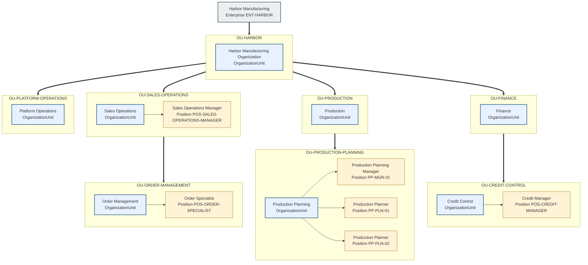
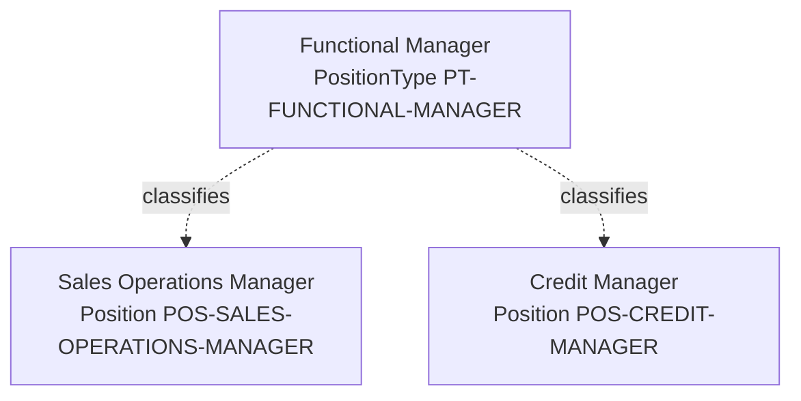
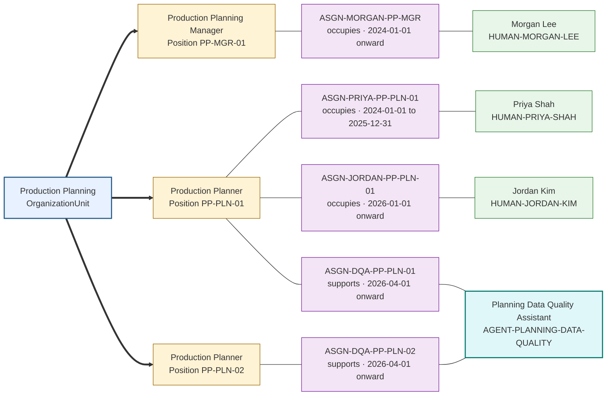

# Harbor Manufacturing Enterprise

Harbor Manufacturing (`ENT-HARBOR`) contains three functional organization units and one supporting unit beneath its root organization unit `OU-HARBOR`:

- Sales Operations (`OU-SALES-OPERATIONS`) owns customer-order intake and exception coordination; Order Management is its child unit.
- Production (`OU-PRODUCTION`) owns planning and fulfillment readiness; Production Planning is its child unit.
- Finance (`OU-FINANCE`) owns credit policy and financial control; Credit Control is its child unit.
- Platform Operations (`OU-PLATFORM-OPERATIONS`) operates agent runtimes without holding business authority.

Each subgraph represents one `OrganizationUnit` and contains the `Position` objects that belong to it. Thick edges are the `parentUnitId` tree; thin edges are `organizationUnitId` placement. The tree edges target subgraph IDs rather than internal organization-unit nodes because Mermaid ignores a subgraph's local direction when one of its internal nodes has an external edge.

Each position belongs to exactly one organization unit but remains a different type of Charter object. The two Production Planner positions share a display name and keep distinct identifiers.

## Position types across organization units

`PT-FUNCTIONAL-MANAGER` is a `PositionType` that classifies the Sales Operations Manager and Credit Manager positions. Those positions belong to different organization units and retain different identifiers.

The shared type means the positions have the same broad organizational nature. It does not place them in the same organization unit, make them report to one another, or copy roles, responsibilities, assignments, or authority between them. Those relationships remain explicit on the individual positions and related Charter objects.

## Production Planning position assignments

The following focused example distinguishes stable positions from the human and agent identities assigned to support them. It shows human succession, an agent supporting two positions, and a position that is currently unfilled. `REL-PP-PLN-01-REPORTS-TO-PP-MGR-01` records the reporting line as a separate `OrganizationRelationship`.

`PP-PLN-01` remains the same position while its human occupant changes from Priya Shah to Jordan Kim. The Planning Data Quality Assistant supports both planner positions through two distinct assignments, preserving separate context and authority for each position; it never becomes a position, displaces a human occupant, or inherits a position's authority. `PP-PLN-02` has no human occupant and is vacant for human occupancy even though it has an agent-support assignment. Because assignments are separate, effective-dated objects, identities never become part of the stable organization-unit or position structure.

The Sales Operations Manager position is accountable for resolving blocked customer orders. The Order Specialist position investigates individual exceptions. The Credit Manager position owns credit-policy decisions. The Production Planner position `PP-PLN-01` confirms material and capacity feasibility. Responsibilities remain attached to positions when the assigned people change.

## Roles and responsibilities

Roles group related responsibilities; they are not positions, identities, or external-system permission sets. Harbor uses the following objects in the order-exception scenario without adding nodes to the organization chart:

| Object | Kind | Expected outcome | Accountable position |
|---|---|---|---|
| `ROLE-ORDER-EXCEPTION-SUPPORT` | Role | Groups coordination responsibilities used across an exception | Not applicable; accountability belongs to each responsibility |
| `RESP-COORDINATE-ORDER-EXCEPTION` | Responsibility | A blocked order reaches an authorized disposition or documented escalation | Sales Operations Manager |
| `RESP-INVESTIGATE-ORDER-EXCEPTION` | Responsibility | Required facts and feasible alternatives are identified | Order Specialist |
| `RESP-APPROVE-CREDIT-EXCEPTION` | Responsibility | Credit risk is explicitly accepted or rejected within policy | Credit Manager |
| `RESP-CONFIRM-FULFILLMENT-FEASIBILITY` | Responsibility | Material and capacity feasibility is current and evidenced | Production Planner |

`ROLE-ORDER-EXCEPTION-SUPPORT` contains the coordination and investigation responsibilities. Role membership does not transfer the Credit Manager's approval authority, and a similarly named SAP business role or authorization does not automatically confer Charter authority.
