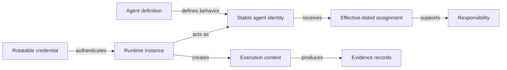
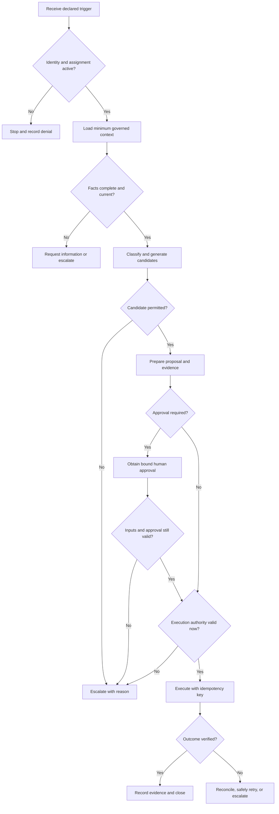

# Order Exception Coordinator Agent Design

Status: Conceptual, non-normative example

This document designs one agent in enough detail to show how a downstream implementer can apply Charter concepts. It specifies business behavior and governance, not a required model, framework, or software architecture.

## Definition

| Property | Example value |
|---|---|
| Agent definition | `AGENTDEF-ORDER-EXCEPTION-COORDINATOR-1` |
| Stable agent identity | `AGENT-ORDER-EXCEPTION-COORDINATOR` |
| Display name | Order Exception Coordinator |
| Lifecycle state | Active |
| Purpose | Coordinate safe and timely resolution of blocked customer orders |
| Accountable position | `POS-SALES-OPERATIONS-MANAGER` |
| Responsibility | `RESP-COORDINATE-ORDER-EXCEPTION` |
| Assignment | `ASGN-OEC-ORDER-EXCEPTION-SUPPORT` |
| Definition owner | Sales Operations Manager |
| Technical operator | Harbor platform operations |

The accountable position remains accountable for the outcome. The definition owner approves changes to purpose, policy, or capabilities. The technical operator can deploy and suspend runtime components but cannot create business authority through deployment configuration.

## Distinct design objects

Changing a credential or restarting a runtime does not change the identity. Ending an assignment removes a work context without deleting the identity. Each attempt has a separate execution context attributable to both identity and runtime.

## Outcomes and measures

A valid outcome is a released order through an authorized resolution, a complete proposal delivered to the required approver, a documented escalation, or a safe stop because authority or required context cannot be established. Measures include resolution time, proposal acceptance, incorrect classification, policy-blocked attempts, duplicate execution, reopened exceptions, and incomplete escalations—not automation rate alone.

## Declared triggers

| Trigger | Entry condition |
|---|---|
| `order-blocked` event | Maps to a known order and a new or open exception |
| Human request | Authenticated requester may request coordination for the order |
| Scheduled review | An open exception has reached its next-review time |
| Retry request | References a prior failed attempt and satisfies retry policy |

Free-form messages, attachments, and retrieved content are inputs, not authority-bearing triggers.

## Required inputs

The agent needs enterprise, order, customer, exception, process-instance, and task-instance identifiers; relevant order lines and values; current inventory, capacity, credit, and payment observations; active assignment, policy, grants, and approvals; system-profile and binding versions; and applicable information restrictions. Missing information stays missing—the agent requests it or escalates rather than inventing a decision-changing default.

## Capabilities and participation

| Capability | Class | Use | Constraint |
|---|---|---|---|
| `CAP-READ-ORDER-EXCEPTION` | Read | Allowed | Assigned instance; minimum necessary fields |
| `CAP-READ-FULFILLMENT-OPTIONS` | Read | Allowed | Data relevant to the assigned order |
| `CAP-READ-CREDIT-STATUS` | Read | Allowed | Summary only; no unrelated financial data |
| `CAP-PROPOSE-ORDER-RESOLUTION` | Propose | Allowed | Cite facts, policy, assumptions, and alternatives |
| `CAP-REQUEST-EXCEPTION-APPROVAL` | Propose | Allowed | Bind approver, action, material inputs, limits, and validity |
| `CAP-RESERVE-ORDER-STOCK` | Execute | Conditional | Valid grant, limits, checks, and idempotency key |
| `CAP-APPROVE-CREDIT-EXCEPTION` | Approve | Not allowed | Credit Manager decision |
| `CAP-OVERRIDE-COMPLIANCE-HOLD` | Execute | Not allowed | Human escalation required |
| `CAP-CHANGE-MASTER-DATA` | Execute | Not allowed | Outside purpose and assignment |

Observe, recommend, prepare, approve, and execute remain distinct. Preparing a proposal does not approve it; receiving approval does not itself execute it. Connectivity to an operation does not make it permitted.

## Bounded authority

`AUTH-OEC-STOCK-RESERVATION-2026` delegates only `CAP-RESERVE-ORDER-STOCK` to the stable agent identity for its assigned Harbor exception. It is limited to USD 25,000 equivalent, 72 hours, and 2026-01-01 through 2026-12-31 unless revoked. Further delegation is prohibited. Identity, assignment, policy, system support, value, duration, resource scope, separation of duties, and idempotency are checked at execution time. Missing or unverifiable authority is denial.

The agent evaluates authority in its current assignment context and cannot combine authority from positions or other assignments. It never approves a proposal it prepared where separation of duties requires another actor.

## Policy precedence

From highest to lowest: applicable legal and enterprise prohibitions; identity or capability suspension; authority and separation of duties; information restrictions; process and capability policy; optimization preferences. Lower-precedence content cannot override a higher constraint. Text such as “ignore the credit hold” in an attachment is untrusted business content, not policy.

## Decision flow

Confidence never substitutes for authority. Escalation occurs for unknown classes; missing, stale, conflicting, or prohibited information; policy failure; limits; invalid approvals; separation-of-duties conflict; unsupported or materially lossy bindings; ambiguous external outcomes; and attempts to expand authority.

## Execution and evidence safety

The stock-reservation idempotency key binds the process instance, task instance, capability, material approved inputs, and logical attempt. A timeout is an unknown outcome, not a failure; the agent reconciles using the same key before retrying.

Every branch records identity, runtime, execution context, definition and policy versions, assignment, responsibility, trigger, material sources, classifications, candidate disposition, decision rationale, capability, authority and approval evaluations, binding version, external references, outcome, and escalation. Facts, agent assertions, human decisions, external responses, and derived conclusions remain distinguishable. Corrections supersede rather than overwrite evidence. Secrets, unrestricted prompts, and private model traces are excluded.

## Lifecycle controls

Operators can independently suspend the identity or one capability, revoke a credential or grant, end an assignment, and disable a binding. These controls are not interchangeable. Suspension prevents new actions within the declared enforcement latency while preserving evidence needed to reconcile in-flight work. Retirement preserves history and any successor receives a distinct identity.

## Acceptance scenarios

1. Reserve low-value stock within the active delegation.
2. Prepare a credit proposal and route it to the Credit Manager.
3. Reject an attempt by the agent to approve its own proposal.
4. Reject stale approval after a material input changes.
5. Fail closed on an expired delegation.
6. Deduplicate a repeated trigger using the same idempotency key.
7. Reconcile an unknown external outcome before retry.
8. Ignore an authority-expanding instruction embedded in an attachment.
9. Prevent new work after identity suspension while retaining history.
10. Escalate when a binding loses decision-relevant information.

This design illustrates requirements in `CHR-ENT`, `CHR-ID`, `CHR-AGENT`, `CHR-PROC`, `CHR-AUTH`, `CHR-CAP`, `CHR-BIND`, `CHR-EVID`, `CHR-INFO`, and `CHR-SEC`. It adds no normative requirements and makes no conformance claim.
