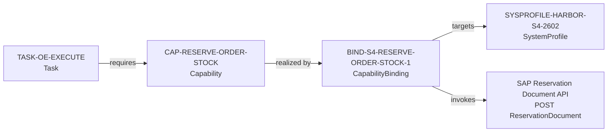

# SAP S/4HANA Cloud Binding Example

Status: Conceptual, non-normative example

Harbor Manufacturing uses SAP S/4HANA Cloud Public Edition in this example. This page demonstrates one complete vendor-specific binding, not every SAP interaction needed by the order-exception process. It is not an SAP-certified design, and an implementation must verify the API and configuration against its own tenant and release.

SAP and SAP S/4HANA are trademarks or registered trademarks of SAP SE or its affiliates. This project is not affiliated with or endorsed by SAP.

## What is linked



The process task contains no SAP URL. It references the stable Charter capability. The binding supplies the SAP operation for a declared system profile, so Harbor can replace or version the SAP realization without redefining the process.

## System profile

`SYS-HARBOR-S4` is Harbor's SAP system. `SYSPROFILE-HARBOR-S4-2602` identifies SAP S/4HANA Cloud Public Edition release 2602, Harbor's tenant configuration, the Reservation Document OData V4 service version `0001`, its authentication arrangement, and its verified operational constraints. A different SAP release or deployment receives a different or explicitly compatible profile.

## Capability binding

`BIND-S4-RESERVE-ORDER-STOCK-1` maps `CAP-RESERVE-ORDER-STOCK` to this illustrative operation:

```http
POST <host>/sap/opu/odata4/sap/api_reservation_document/srvd_a2x/sap/apireservationdocument/0001/ReservationDocument
Content-Type: application/json
```

```json
{
  "GoodsMovementType": "231",
  "ReservationDate": "2026-06-18",
  "SalesOrder": "50000173",
  "SalesOrderItem": "10",
  "_ReservationDocumentItem": [
    {
      "Plant": "<plant>",
      "StorageLocation": "<storage-location>",
      "Product": "<product>",
      "MatlCompRequirementDate": "2026-06-20",
      "EntryUnit": "PC",
      "ResvnItmRequiredQtyInEntryUnit": 30
    }
  ]
}
```

SAP documents the Reservation Document API as supporting reservation creation with this OData V4 resource. See [SAP Reservation Document operations](https://help.sap.com/docs/SAP_S4HANA_CLOUD/3f57e7df4a114edabffe8b2d581a59ed/778f4803e1f64675a5430de153dd6ddb.html?locale=en-US&state=PRODUCTION&version=2602.500).

`DATABIND-S4-ORDER-EXCEPTION-1` maps Charter order `ORD-2026-0173` and its example line to SAP sales order `50000173`, item `10`. Movement type `231` makes the sales-order fields applicable in this example; SAP documents `SalesOrder` and `SalesOrderItem` as mandatory header properties for movement types 231 and 232. See [SAP Reservation Document Header](https://help.sap.com/docs/SAP_S4HANA_CLOUD/3f57e7df4a114edabffe8b2d581a59ed/03a55f57017647368bfb386e41573ff7.html).

This example does not claim that every SAP reservation has the same business meaning as Charter's order-stock reservation. The binding is usable only where Harbor's configured SAP operation preserves the capability's outcome, resource scope, and limits.

## Binding obligations

| Concern | Example treatment |
|---|---|
| Inputs | Map product, quantity, unit, plant, storage location, requirement date, and configured account assignment |
| Outputs | Map the returned SAP reservation identifier and verified quantities to the Charter outcome |
| Authority | Evaluate the Charter grant and approval before invoking SAP; an SAP credential is not the agent's business authority |
| Errors | Keep SAP business messages distinct from authentication, authorization, OData, network, and parsing failures |
| Idempotency | Use an adapter invocation ledger; do not assume the create operation accepts a native Charter idempotency key |
| Evidence | Link the task instance, capability invocation, binding and profile versions, request digest, SAP response, and reservation identifier |
| Support | Declare reservation expiry and any other unmapped contract feature partial or unsupported |

Before the call, `AUTHBIND-S4-RESERVE-ORDER-STOCK-1` places SAP authorization behind a trusted action boundary that verifies the active identity and assignment, `AUTH-OEC-STOCK-RESERVATION-2026`, value and duration limits, approvals, separation of duties, information permissions, and binding support. SAP authorization is an additional enforcement layer and cannot broaden that grant.

An HTTP success alone is not a successful Charter outcome. The adapter must obtain the expected SAP reservation identifier and verify that the result preserves the requested business quantities. Any lossy or missing decision-relevant mapping is declared and causes denial or escalation when it affects authority or outcome.

After a timeout, the outcome is unknown. The adapter attempts reconciliation using its invocation record and available SAP references before retrying. If it cannot establish whether the reservation was created, it escalates rather than issuing a blind second `POST`.

## Runtime trace

For `TASKINST-OE-0042-EXECUTE`, the invocation evidence connects:

```text
PROCINST-OE-2026-0042
  → TASKINST-OE-0042-EXECUTE
  → CAP-RESERVE-ORDER-STOCK
  → BIND-S4-RESERVE-ORDER-STOCK-1
  → SYSPROFILE-HARBOR-S4-2602
  → SAP reservation identifier
```

`EVTBIND-S4-ORDER-BLOCKED-1` delivers the blocked-order business event to the agent's `order-blocked` trigger at least once. This provides one complete example of the Task-to-Capability-to-Binding-to-API pattern. Other Harbor process steps intentionally remain conceptual rather than documenting every SAP endpoint.
