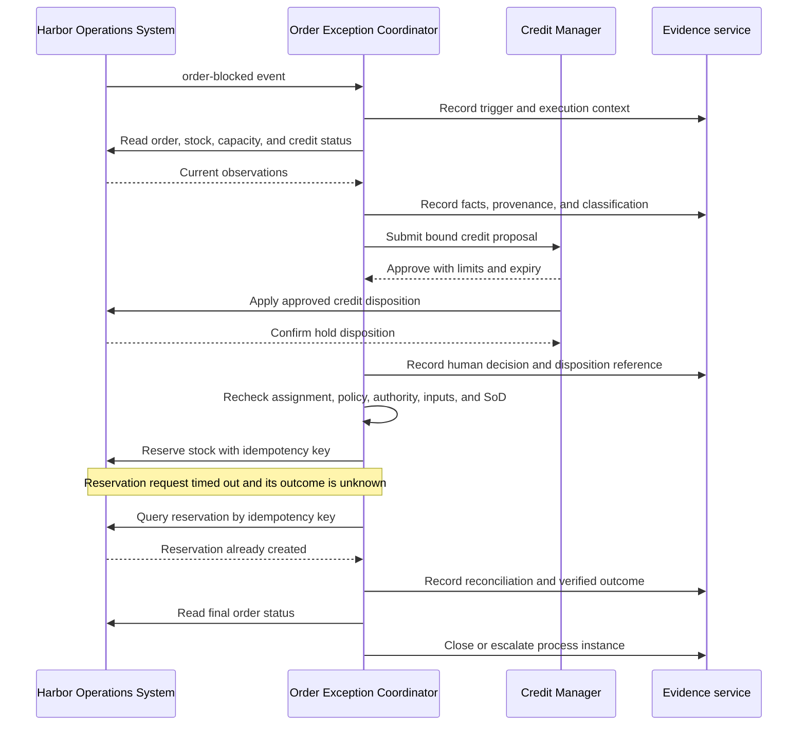

# Order Exception Execution Walkthrough

Status: Conceptual, non-normative example

This walkthrough connects the example objects through `PROCINST-OE-2026-0042`, concerning a material and credit hold on order `ORD-2026-0173`.

## Trace

| Step | Task instance | Performer mode | Principal artifacts |
|---|---|---|---|
| 1 | `TASKINST-OE-0042-DETECT` | Agent observes | Trigger, identity, runtime, event binding |
| 2 | `TASKINST-OE-0042-GATHER` | Agent observes | Current facts, classifications, provenance |
| 3 | `TASKINST-OE-0042-PREPARE` | Agent recommends and prepares | Candidate resolutions and proposal |
| 4 | `TASKINST-OE-0042-APPROVE` | Human approves | Bound approval, decision rationale, and applied credit disposition |
| 5 | `TASKINST-OE-0042-EXECUTE` | Agent executes | Grant evaluation, idempotency key, binding, external result |
| 6 | `TASKINST-OE-0042-VERIFY` | Agent observes | Reconciliation, verified outcome, closure evidence |

The timeout does not cause an immediate second mutation. The agent treats the outcome as unknown, reconciles it, discovers the existing reservation, and records `already-reserved`. The process definition remains unchanged by these instance states.
