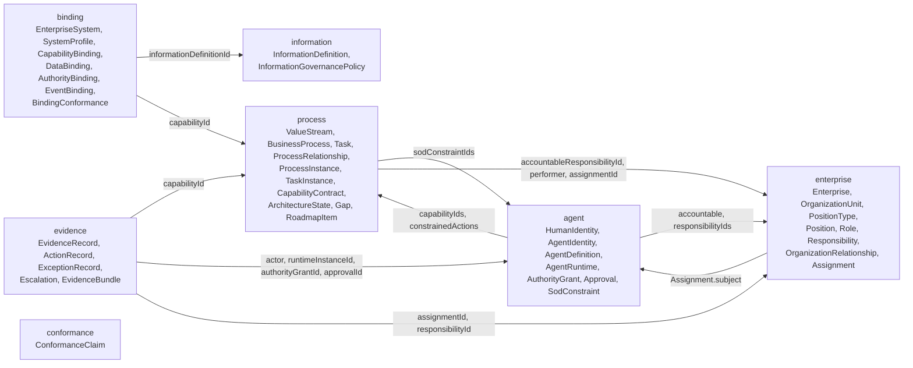

# Charter Schemas

Status: Version 1.0.0; every catalogued schema is normative and every conformance profile is active.

This directory contains language-independent JSON Schemas for Charter instance documents. Schema structure mirrors the specification domains:

- `enterprise/`: enterprises, organization-unit trees, position types, positions, roles, responsibilities, and assignments
- `agent/`: identities, agent definitions and runtimes, authority, approval, and separation of duties
- `process/`: value streams, process and task definitions and instances, capabilities, relationships, and architecture states
- `binding/`: system profiles and capability, data, authority, and event bindings
- `evidence/`: action evidence, decisions, exceptions, audit trails, and information provenance
- `information/`: information definitions and governance policies
- `conformance/`: bounded conformance claims; rule activation remains outside the schema directory

## Authority and versioning

Schemas and normative prose are jointly authoritative. Schemas determine structural instance validity but do not override behavioral requirements in `spec/`.

Every schema has a stable `$id`, the specification version it targets, its own artifact version, requirement references, and:

- A versioned entry in the schema catalogue
- Explicitly documented extension points
- Valid and invalid fixtures for every active structural rule
- Semantic rules for constraints that JSON Schema cannot establish across documents

Placeholder schemas that accept arbitrary content are intentionally avoided; a kind enters the catalogue only with its rules and fixtures active in `conformance/manifest.yaml`.

## References and validation

A string-valued `idRef` resolves in the referring document's namespace. Cross-namespace references use `{ "namespace": "...", "id": "..." }`. Validators must not guess a namespace from an identifier prefix.

Because each schema has an absolute `$id`, an offline validator must register the local schema file under that `$id` before resolving relative `$ref` values. `catalog.json` provides the mapping. Validation must use JSON Schema draft 2020-12, support `unevaluatedProperties`, enable `format` assertion for `date` and `date-time` values, and accept or register the `x-charter-*` annotation keywords.

Every property typed as `idRef` carries `x-charter-ref-kinds`, the document kinds it may name; a semantic rule (CHR-RULE-CONF-002) checks resolved references against it, so the annotation is the single source of the target kind for CHR-CONF-012.

Structural validation alone cannot establish graph acyclicity, reference existence or kind, date ordering, authority effectiveness, or runtime behavior. Those constraints require active semantic or behavioral conformance rules.

## Domain relations

Arrows read "references"; each domain diagram in its README shows the properties.

Every document also references its `Enterprise` through `enterpriseId`, except binding and conformance documents.