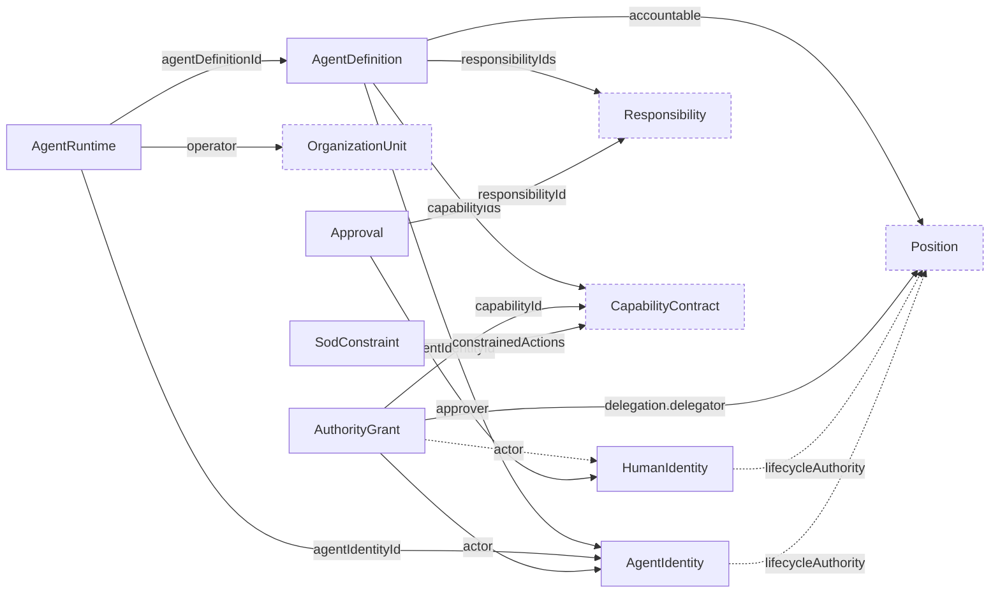

# Agent Schemas

Draft schemas for the `CHR-ID`, `CHR-AGENT`, and `CHR-AUTH` domains: `human_identity`, `agent_identity`, `agent_definition`, `agent_runtime`, `authority_grant`, `approval`, and `sod_constraint`.

Identity, definition, grant, and approval are separate documents; an agent definition must declare purpose, triggers, inputs, outcomes, capabilities, policies, and escalation conditions.

## Relations

Dashed nodes belong to other domains.