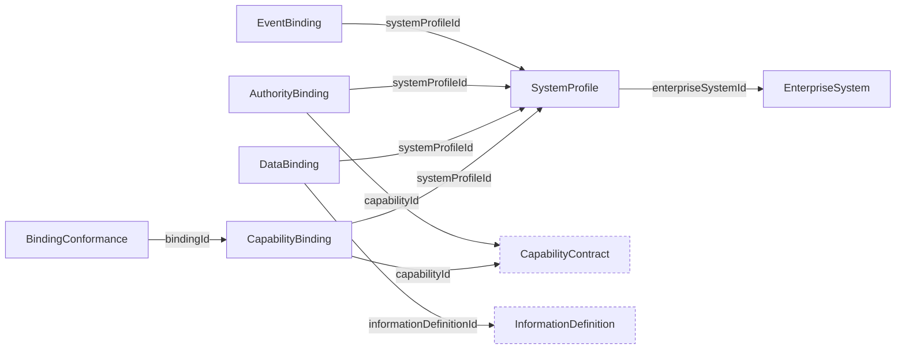

# Binding Schemas

Schemas for the `CHR-BIND` domain: `enterprise_system`, `system_profile`, `capability_binding`, `data_binding`, `authority_binding`, `event_binding`, and `binding_conformance`.

Binding documents are not enterprise-scoped; profiles and bindings may be shared catalogs. Every binding identifies its version, target profile, and feature support. `binding_conformance` uses the shared `conformanceClaimEnvelope` in `schema/common.schema.json` and adds binding-specific feature evaluation. Capability bindings map inputs, outputs, business errors, authority checks, idempotency, and evidence. Vendor-specific bindings may appear as non-normative examples but do not enter Charter core semantics.

## Relations

Dashed nodes belong to other domains. `BindingConformance.bindingId` may name any binding kind.