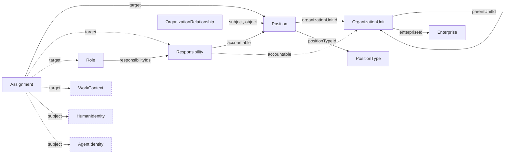

# Enterprise Schemas

Schemas for the `CHR-ENT` domain: `enterprise`, `organization_unit`, `position_type`, `position`, `role`, `responsibility`, `assignment`, and `organization_relationship`, sharing `../common.schema.json`.

Objects and relationships are separate records: the unit tree is `parentUnitId`, position classification is `positionTypeId`, position placement is `organizationUnitId`, and every other relation is an explicit `OrganizationRelationship` or `Assignment` document. See [ADR 0001](../../doc/adr/0001-enterprise-object-relationship-model.md).

## Relations

Dashed nodes belong to other domains or are external kinds.