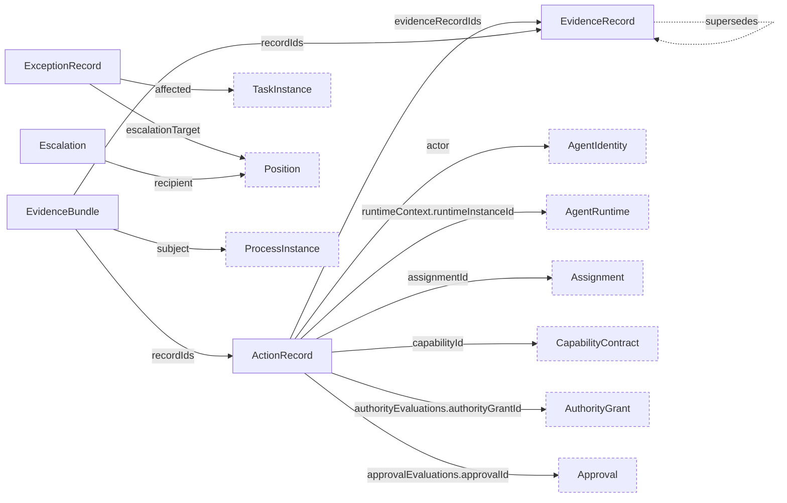

# Evidence Schemas

Draft schemas for the `CHR-EVID` domain: `evidence_record`, `action_record`, `exception`, `escalation`, and `evidence_bundle`.

Records are categorized (observed fact, agent assertion, human decision, external response, derived conclusion), and corrections supersede rather than replace. Derived conclusions require sources and transformations. Executed-action records require structured runtime, authority, and approval evaluations; evidence bundles declare their assurance profile and integrity method.

## Relations

Dashed nodes belong to other domains.