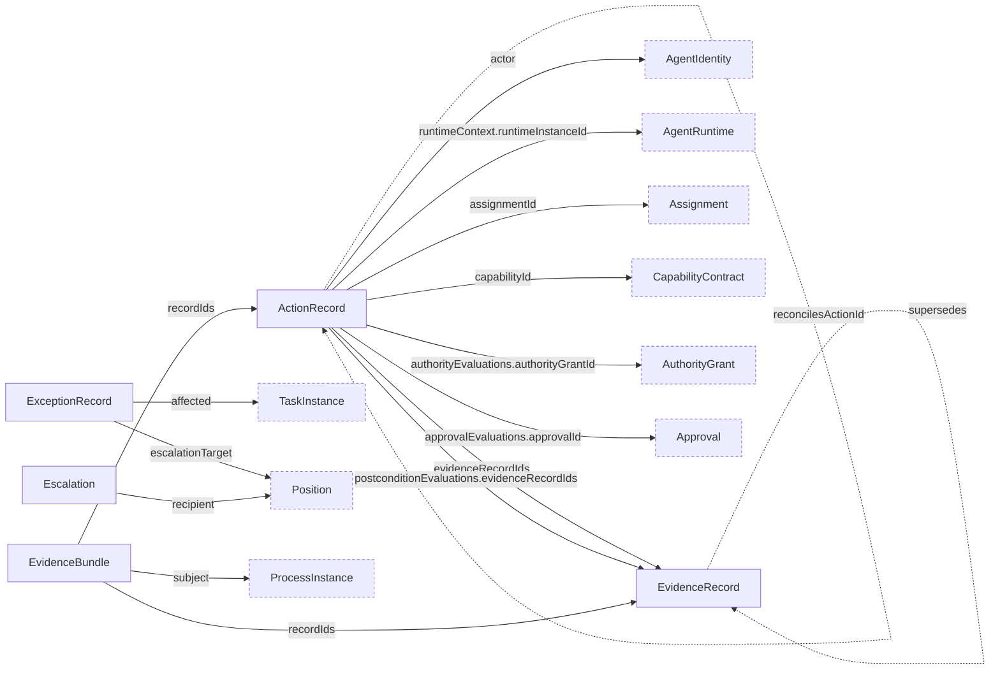

# Evidence Schemas

Schemas for the `CHR-EVID` domain: `evidence_record`, `action_record`, `exception`, `escalation`, and `evidence_bundle`.

Records are categorized (observed fact, agent assertion, human decision, external response, derived conclusion), and corrections supersede rather than replace. Derived conclusions require sources and transformations. Every action record states its `disposition` (executed, business-error, denied, failed, unknown) so stopped attempts are evidenced like executed ones (CHR-EVID-010); executed-action records require structured runtime, authority, and approval evaluations, and `informationEvaluations` records information-governance decisions; an action record carries the `postconditionEvaluations` observed for its capability, each satisfied or violated result resting on observed-fact records (CHR-EVID-011), and a record that settles an earlier unknown attempt names it in `reconcilesActionId` rather than restating it (CHR-EVID-012); evidence bundles declare their assurance profile and integrity method, and a single record may carry an `integrity` digest of its content.

## Relations

```mermaid
flowchart LR
    EvidenceRecord -.->|supersedes| EvidenceRecord
    ActionRecord -->|actor| AgentIdentity
    ActionRecord -->|runtimeContext.runtimeInstanceId| AgentRuntime
    ActionRecord -->|assignmentId| Assignment
    ActionRecord -->|capabilityId| CapabilityContract
    ActionRecord -->|authorityEvaluations.authorityGrantId| AuthorityGrant
    ActionRecord -->|approvalEvaluations.approvalId| Approval
    ActionRecord -->|evidenceRecordIds| EvidenceRecord
    ActionRecord -->|postconditionEvaluations.evidenceRecordIds| EvidenceRecord
    ActionRecord -.->|reconcilesActionId| ActionRecord
    ExceptionRecord -->|affected| TaskInstance
    ExceptionRecord -->|escalationTarget| Position
    Escalation -->|recipient| Position
    EvidenceBundle -->|subject| ProcessInstance
    EvidenceBundle -->|recordIds| EvidenceRecord
    EvidenceBundle -->|recordIds| ActionRecord

    classDef ext stroke-dasharray: 4 3
    class AgentIdentity,AgentRuntime,Assignment,CapabilityContract,AuthorityGrant,Approval,TaskInstance,Position,ProcessInstance ext
```

Dashed nodes belong to other domains.