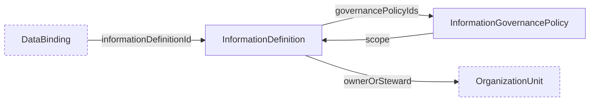

# Information-Governance Schemas

Schemas for the `CHR-INFO` domain: `information_definition` and `information_governance_policy`.

An information definition states business meaning and ownership and links to explicit governance policies. Policies declare permitted uses, access constraints, retention and deletion rules, precedence, and conflict behavior. These schemas describe governed information without defining a universal enterprise data model.

## Relations

Dashed nodes belong to other domains.