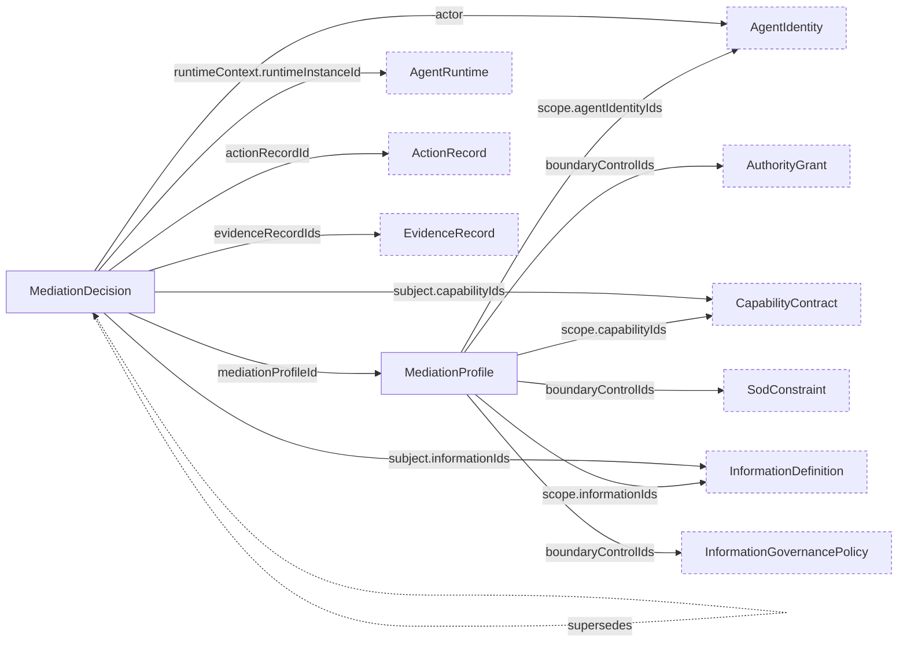

# Mediation Schemas

Schemas for the `CHR-MED` domain: `mediation_profile` and `mediation_decision`.

A `MediationProfile` declares a point at which a governed act is submitted for decision before it takes effect: the stage, the mediator, the scope, the outcomes it may issue, its enforcement mode, its failure policy, its decision budget, the coverage it claims, and the provenance of the attributes a decision may rest on. Common stages cover model, tool, retrieval, memory, session, and turn hooks; a binding may name other distinct hooks. An asserted attribute may only tighten a constraint (CHR-MED-007), which the schema enforces structurally. In `shadow` mode decisions are reached and evidenced while the act proceeds regardless; in `enforce` mode they govern it (CHR-MED-002).

A `MediationDecision` records one decision and identifies the actor and the capability and information definitions relevant to the submitted act. Empty lists mean none applies. `actEffective` must be false, because a decision reached after the act took effect is not mediation, and `enforced` states whether the decision governed the act (CHR-MED-002). Every non-allow outcome carries an audit reference and subject-facing reason; `ask` and `defer` also carry handoff details (CHR-MED-004). Applied obligations may accompany any outcome, including decision-handling duties after denial. A modify carries an applied obligation when enforced or a proposed obligation in shadow mode (CHR-MED-008). An act that proceeded without a decision is recorded as `not-decided` with its reason, never as an allow, and a mediator that produced no usable decision records the failure policy applied (CHR-MED-005, CHR-MED-006).

The profile states the outcome vocabulary and enforcement mode; a decision naming an outcome the profile does not declare, or recorded as enforced under a shadow profile, is refused by the semantic rules CHR-RULE-MED-001 and CHR-RULE-MED-002, since JSON Schema cannot compare two documents.

## Relations

Dashed nodes belong to other domains.
