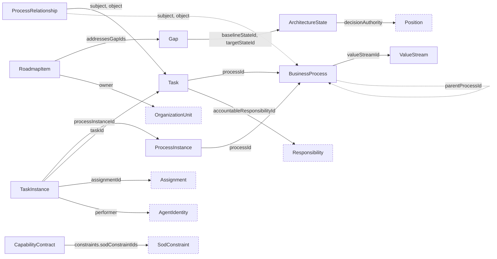

# Process and Capability Schemas

Draft schemas for the `CHR-PROC`, `CHR-CAP`, and `CHR-ARCH` domains: `value_stream`, `business_process`, `task`, `process_relationship`, `process_instance`, `task_instance`, `capability_contract`, `architecture_state`, `gap`, and `roadmap_item`.

Definition and instance documents are separate. Execute contracts must declare idempotency; target architecture states must name their decision authority.

## Relations

Dashed nodes belong to other domains.